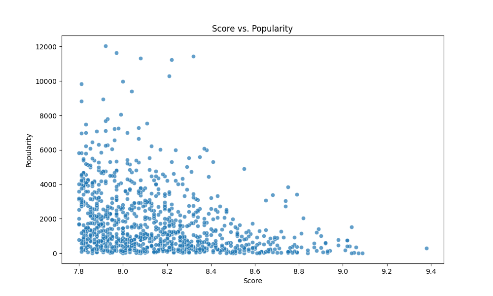
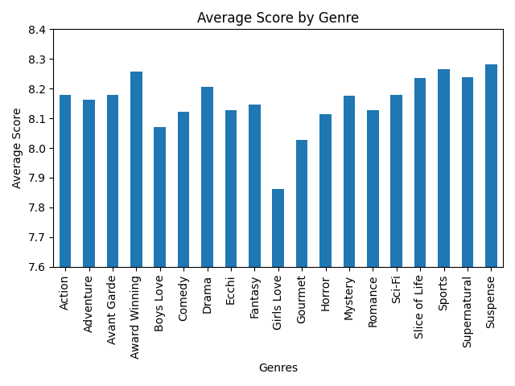
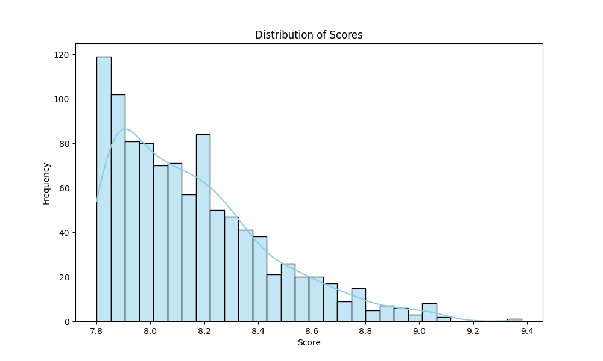
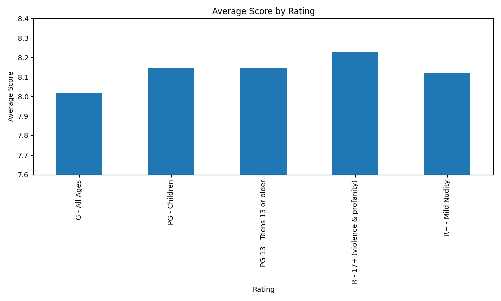
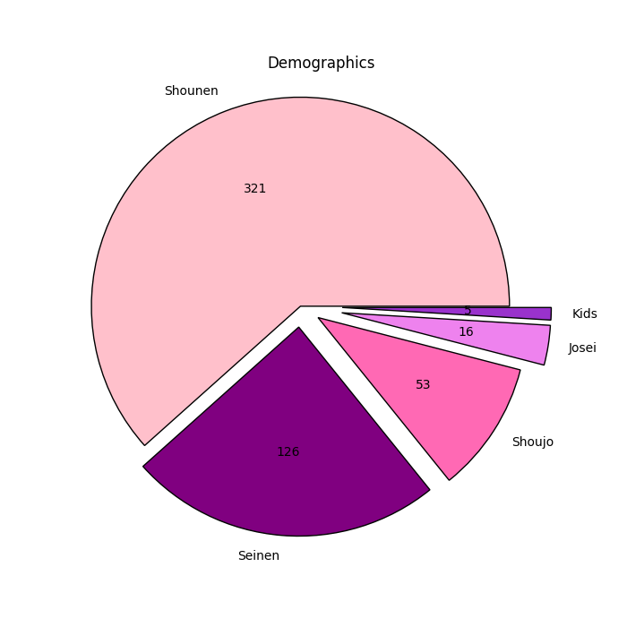
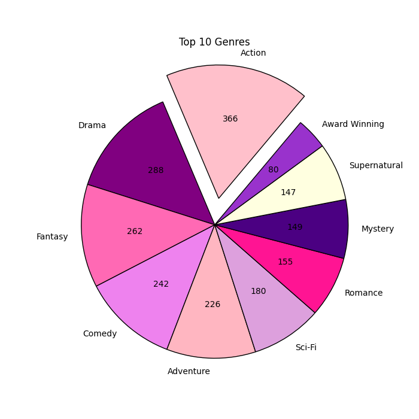

# TopAnimeData
## Project Summary
I performed Exploratory Data Analysis on a dataset of the top anime of 2024. The goal of this analysis is to uncover key patterns and provide insights that can help optimize recommendation systems and predict future anime success. 

## [SOURCE](https://www.kaggle.com/datasets/bhavyadhingra00020/top-anime-dataset-2024/data)

## Cleaning the Data
- Format date consistently
-	Cleaned genres column, duplicates within cells replaced (e.g. ActionAction replaced with Action)
-	Cleaned demographic column, same way as genres
-	Observation: Since the dataset is ranked by score, the popularity column is incomplete. E.g. the 10th most popular anime is not depicted in the dataset because its score is not in the top 1000. However, the 12,000th most popular anime is. The scores vs popularity scatterplot will show the correlation between these two measures. 
-	Saved cleaned dataset as CSV

## Analyzing Data with Python
Analyzed Data with python; used pandas, numpy, matplotlib, and seaborn libraries
The python script I used to analyze the data (and generate the following visualizations) can be found [HERE](https://github.com/r7ckyj/TopAnimeData/blob/909c3098b89c4813d58573bb7c3fdcfc5d340791/topanimedata.py)

## Visualizations With Matplotlib

```
# Score vs. Popularity Scatter Plot 
plt.figure(figsize=(10, 6))
sns.scatterplot(x='Score', y='Popularity', data=df, alpha=0.7)
plt.title('Score vs. Popularity')
plt.xlabel('Score')
plt.ylabel('Popularity')
plt.show()
```
<p align="center">
  
</p>

```
#avg score by genre (split and explode Genres column to make it easier to group)

df["Genres"]=df["Genres"].str.split(', ')
df=df.explode("Genres").replace({np.nan: None})
df.groupby(by = "Genres")["Score"].mean().plot(kind = "bar",ylim=(7.6, 8.4))
plt.title('Average Score by Genre')
plt.xlabel('Genres')
plt.ylabel('Average Score')
plt.tight_layout()
plt.show()
```
```
# Distribution of Scores
plt.figure(figsize=(10, 6)) #assigning figure size 
sns.histplot(df['Score'], bins=30, kde=True, color='skyblue') # creating histogram
plt.title('Distribution of Scores')
plt.xlabel('Score')
plt.ylabel('Frequency')
plt.show()
```
<p align="center">
  
  
</p>

```
#avg score by rating

plt.figure(figsize=(10,6))
df.groupby(by = "Rating")["Score"].mean().plot(kind = "bar",ylim=(7.6, 8.4))

plt.title('Average Score by Rating')
plt.xlabel('Rating')
plt.ylabel('Average Score')
plt.tight_layout()
plt.show()
```
<p align="center">
  
</p>

```
# Demographic Pie Chart
demographic = df["Demographic"].value_counts()
plt.figure(figsize=(7,7))
colors = ['pink','purple','hotpink','violet','darkorchid']
explode=(0,0.1,0.1,0.2,0.2)
values=df["Demographic"].value_counts()
plt.pie(demographic,colors=colors,explode=explode,wedgeprops={'edgecolor':'black'},labels=demographic.index,autopct=lambda x: '{:.0f}'.format(x*values.sum()/100))
plt.title("Demographics")
plt.axis('equal')

plt.show()
```
```
# Top 10 Genres Pie Chart
top_genres = df['Genres'].str.split(',').explode().str.strip().value_counts(dropna=True).head(10)

plt.figure(figsize=(7, 7))
colors = ['pink','purple','hotpink','violet','lightpink','plum','deeppink','indigo','lightyellow','darkorchid']
explode=(0.2,0,0,0,0,0,0,0,0,0)   #to make a distance in selected bar
values=df['Genres'].str.split(',').explode().str.strip().value_counts(dropna=True).head(10)
plt.pie(top_genres,colors=colors,explode=explode,wedgeprops={'edgecolor':'black'},labels= top_genres.index, autopct=lambda x: '{:.0f}'.format(x*values.sum()/100), startangle=50)
plt.title('Top 10 Genres')
plt.axis('equal')  # Equal aspect ratio ensures that pie is drawn as a circle.

plt.show()
```
<p align="center">
   
</p>

Thank you for taking the time to view my project!
